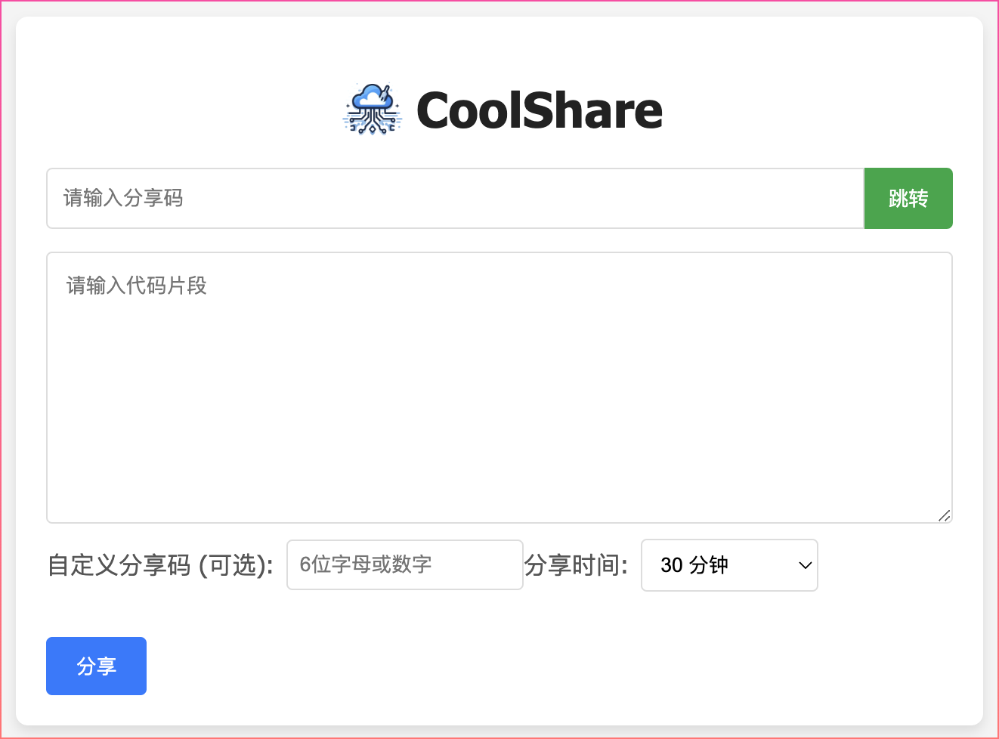
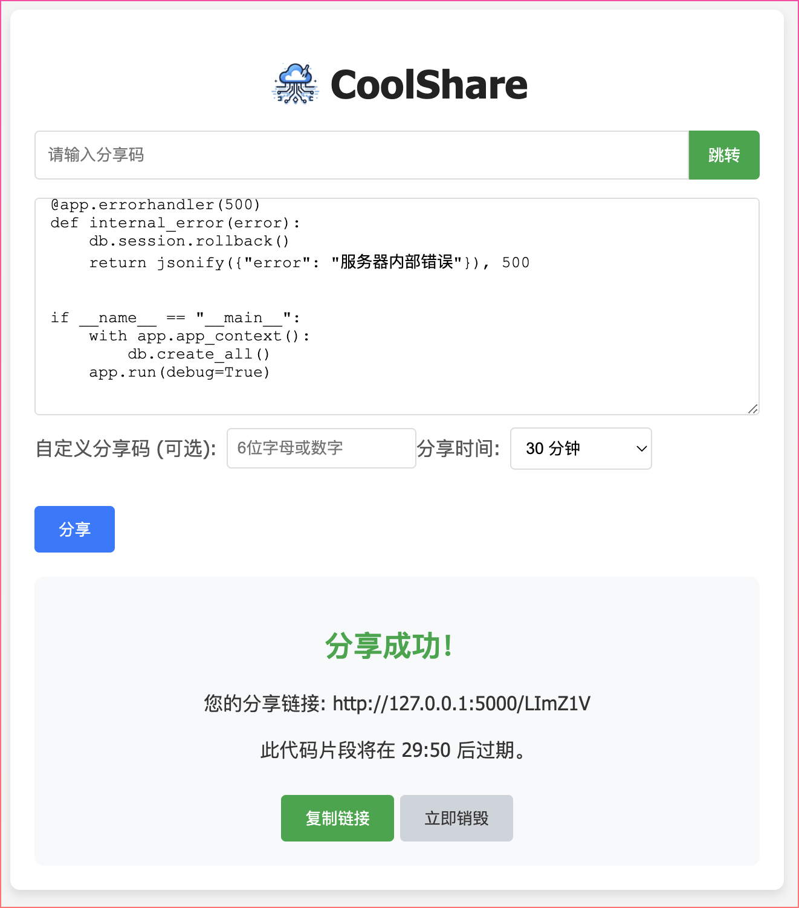
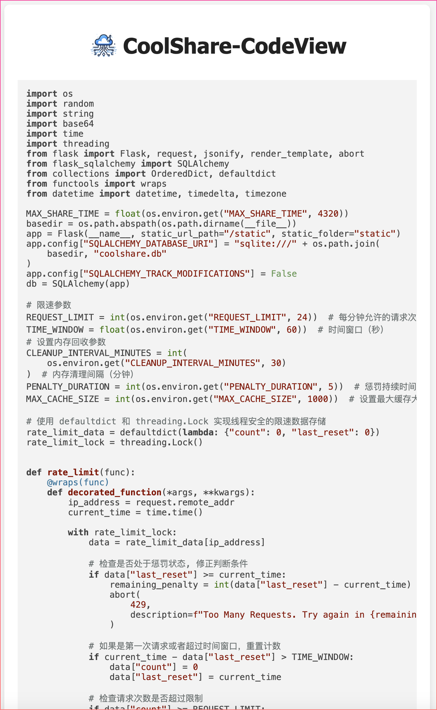
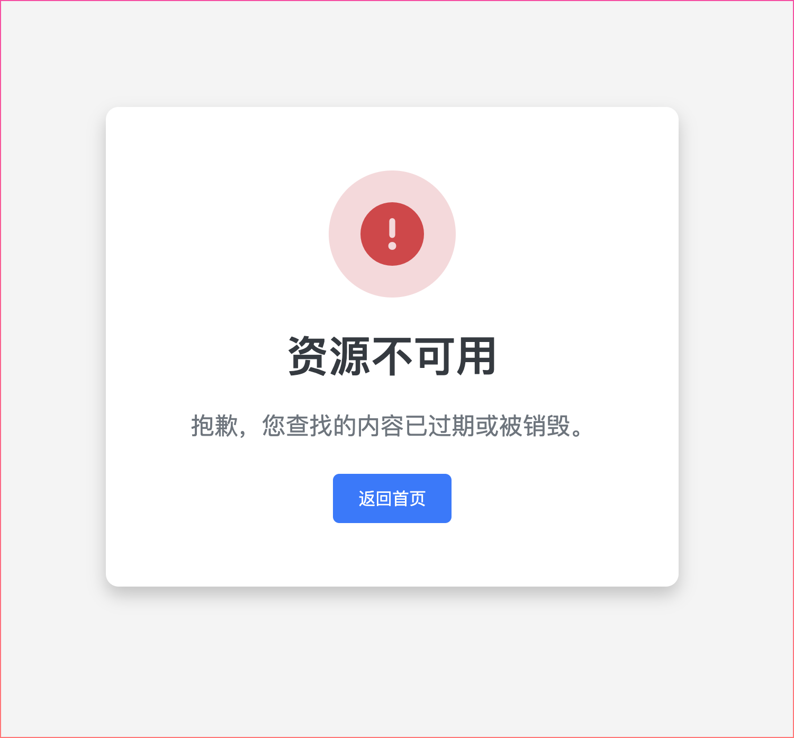

<p align="center">

</p>
<h1 align="center">
  CoolShare
</h1>

<p align="center">
 <a href="docs/README.en.md">English</a> | <a href="README.md">简体中文</a>
</p>

<p align="center">
  <a href="https://github.com/utopeadia/coolshare/blob/main/LICENSE"></a>
  <a></a>
</p>

`CoolShare`是一个非常轻量级、非常简单易用的代码片段分享工具，目的是通过快速的手段搭建个人和团队内部代码协作共享平台

### 特性

20240622更新

* 开箱即用
* 简单轻量（使用了flask或许也不轻量）`</br>`
  项目目录如下：
  ```
  │  
  ├──app/
  │   ├── app.py
  │   ├── templates/
  │   │   ├── index.html
  │   │   ├── view.html
  │   ├── static/
  │   │   ├── style.css
  │   │   ├── script.js
  ├──readme.md
  ├──requirements.txt
  ├──Dockerfile
  ```

### docker部署方法

* 暴露5000端口
* 持久化/app/coolshare.db数据库（可选）
* 配置环境变量（可选）

例如：

```bash
docker run -d --name coolshare --restart always -p 5000:5000 ghcr.io/utopeadia/coolshare:latest
```

```bash
docker run -d --name coolshare --restart always -p 5000:5000 -v ~/coolshare/coolshare.db:/app/coolshare.db ghcr.io/utopeadia/coolshare:latest
```

```bash
docker run -d --name coolshare --restart always -p 5000:5000 -v ~/coolshare/coolshare.db:/app/coolshare.db -e MAX_SHARE_TIME=100 ghcr.io/utopeadia/coolshare:latest
```

### 环境变量说明

| 环境变量名               | 说明                                                          | 是否必须 |
| ------------------------ | ------------------------------------------------------------- | -------- |
| MAX_SHARE_TIME           | 最长分享时间，默认值4320，单位分钟                            | false    |
| REQUEST_LIMIT            | 时间窗口内限制创建和删除总数量，默认值24                      | false    |
| TIME_WINDOW              | 时间窗口，默认值60，单位秒                                    | false    |
| CLEANUP_INTERVAL_MINUTES | 执行ip计数器和数据库清理任务定时，默认值30，单位分钟          | false    |
| PENALTY_DURATION         | 基础的惩罚时长，每次超过限制，惩罚时长翻倍，默认值5，单位分钟 | false    |
| MAX_CACHE_SIZE           | 计数器最大缓存值，默认值1000                                  | false    |






## 许可协议

[GPL](LICENSE):本项目采用 **GPLv3**协议开源
