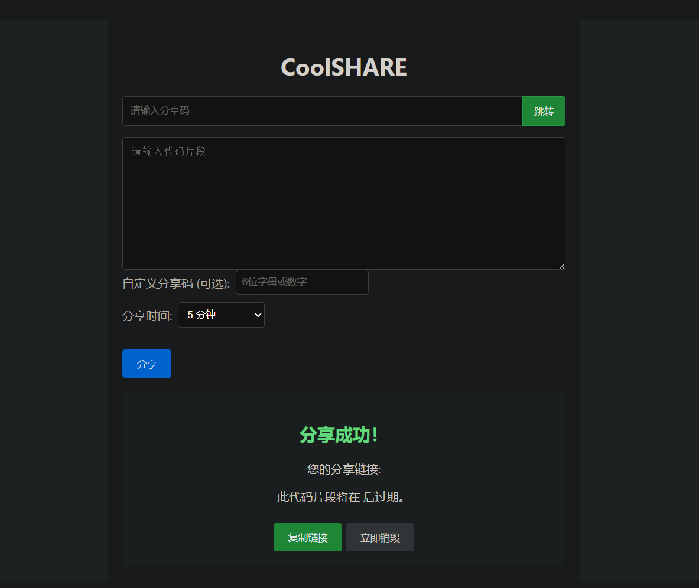
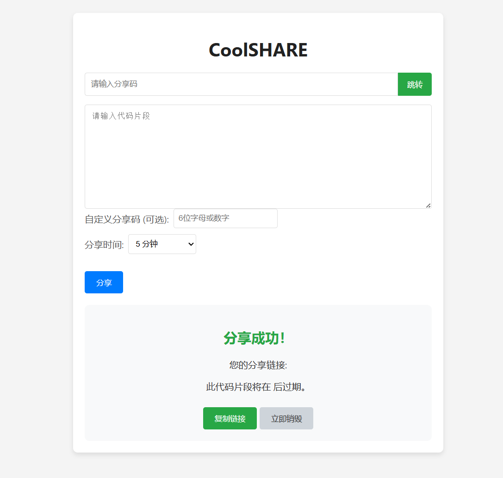
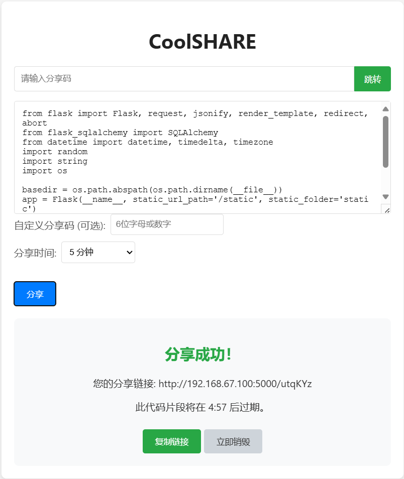
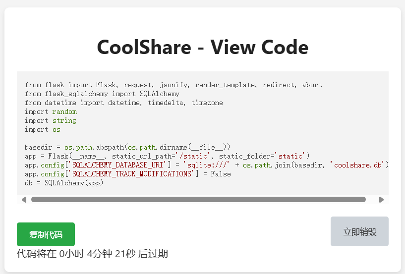
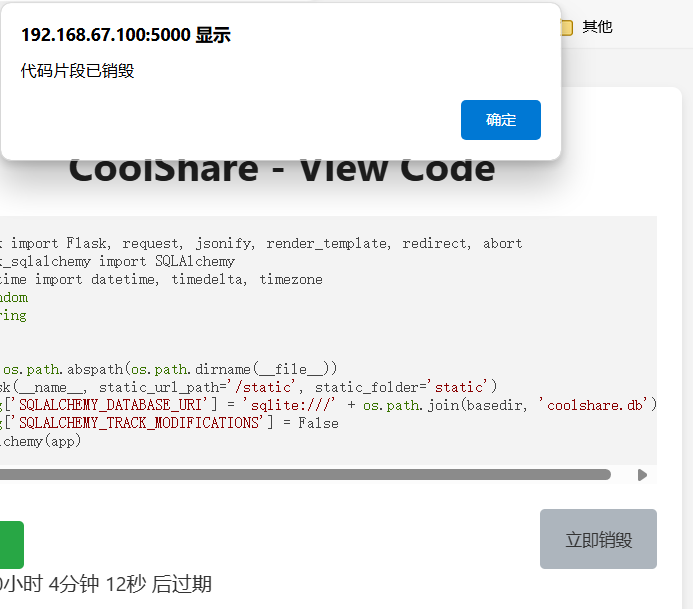
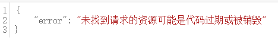

CoolShare - A very lightweight and cool code snippet sharing tool </br>
CoolShare--非常非常轻量级、非常非常酷的代码片段共享工具</br>
## 也许现在可以使用了

20240622更新</br>
只需要暴露5000端口即可</br>
如果需要持久化只需要持久化sqlite db文件即可</br>
例如：</br>

```bash
docker run -d --name coolshare --restart always -p 5000:5000 -v ~/coolshare/coolshare.db:/app/coolshare.db ghcr.io/utopeadia/coolshare:latest
```







## ~Under development, not yet available~
